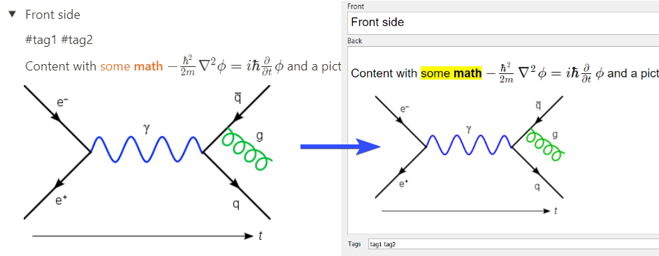

# Notion💗Anki sync
If you organize your study/work in [Notion](https://notion.so), this repo can help
to recall this knowledge by exporting Notion toggle lists as [Anki](https://apps.ankiweb.net/)
flashcards.

[](https://hub.docker.com/r/9dogs/notion-anki-sync)
[](https://github.com/9dogs/notion-anki-sync)
[](https://www.gnu.org/licenses/gpl-3.0)
[](https://github.com/psf/black)

## How it works


- You provide a set of Notion page ids to export
- Every "toggle list" block from Notion will be converted to an Anki card
- ... with a title becoming the front side and content — the backside
- ... and a line starting with `#tags` will be parsed as tags

## Requirements

- Notion API token
- Anki with [AnkiConnect](https://ankiweb.net/shared/info/2055492159) extension

To get **Notion API token** log in to Notion via a browser (assuming Chrome here),
then press `Ctrl+Shift+I` to open developer tools, go to the "Application" tab
and find `token_v2` under Cookie on the left.

To get **Notion page id** open up the page in a browser and look at an
address bar. 32 chars of gibberish after a page title is the page id:
`https://www.notion.so/notion_user/My-Learning-Book-8a775ee482ab43732abc9319add819c5`
➡ `8a775ee482ab43732abc9319add819c5`

## How to run

The easiest way is to use Docker. Fill in values in `.env.example` and run:
```shell
docker run --name notion-anki-sync --restart unless-stopped -v /path/to/.env:/opt/notion-anki-sync/.env 9dogs/notion-anki-sync
```
Watch logs for any unexpected behavior:
```shell
docker logs -f notion-anki-sync
```

## Limitations

- No clozes yet

## Inspiration

This project is inspired by a great [notion2anki](https://github.com/alemayhu/notion2anki).
The main difference is that `notion2anki` creates a *.apkg Deck while `notion-anki-sync`
is more about continuously syncing in a background.
