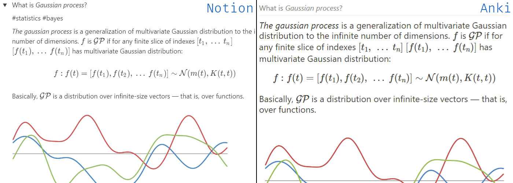

# Anki💗Notion addon

It's an [Anki](https://apps.ankiweb.net/) addon which loads toggle lists from [Notion](https://notion.so) as notes to a specified
deck.

[](https://github.com/9dogs/notion-anki-sync)
[](https://www.gnu.org/licenses/gpl-3.0)
[](https://github.com/psf/black)

## How it works


- You provide a set of Notion page ids to export
- Every "toggle list" block from Notion will be converted to an Anki note
- Title of the toggle block will become the front side and its content — the backside
- The line starting with `#tags` will be parsed as tags

Clozes can be added via `code` blocks in toggle titles. Backside will be
ignored (apart from tags).

## Requirements

### Notion API token

To get **Notion API token** log in to Notion via a browser (assuming Chrome here),
then press `Ctrl+Shift+I` to open Developer Tools, go to the "Application" tab
and find `token_v2` under Cookie on the left.

### Notion page ids

To get **Notion page id** open up the page in a browser and look at the
address bar. 32 chars of gibberish after a page title is the page id:
`https://www.notion.so/notion_user/My-Learning-Book-8a775ee482ab43732abc9319add819c5`
➡ `8a775ee482ab43732abc9319add819c5`

Edit plugin config file from Anki: `Tools ➡ Addons ➡ NotionAnki ➡ Config`
```json
{
  "debug": false,
  "sync_every_minutes": 30,
  "anki_target_deck": "Notion Sync",
  "notion_token": "<your_notion_token_here>",
  "notion_namespace": "<your_notion_username_here",
  "notion_pages": [
    {
      "page_id": "<page_id1>",
      "recursive": false
    },
    {
      "page_id": "<page_id2>",
      "recursive": true
    }
  ]
}
```

## Inspiration

This project is inspired by a great [notion2anki](https://github.com/alemayhu/notion2anki).
